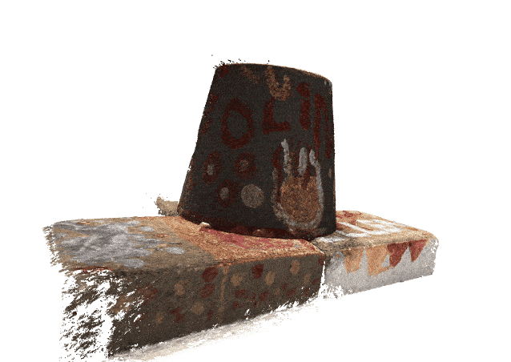
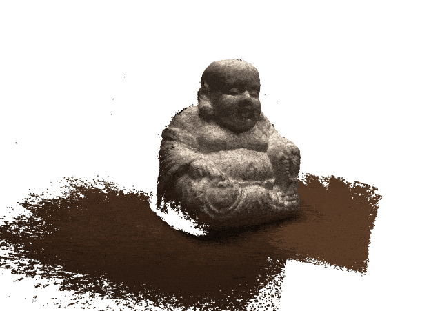
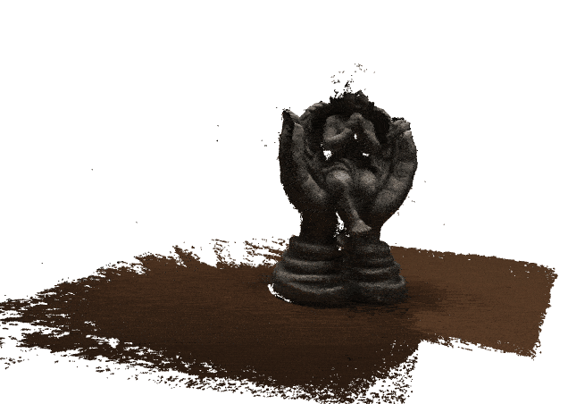
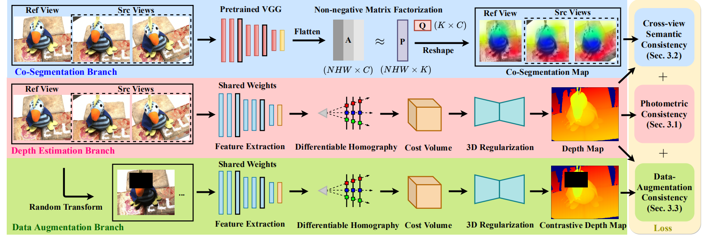

# Self-Supervised-MVS
This repository is the official PyTorch implementation of our AAAI 2021 paper:

"*Self-supervised Multi-view Stereo via Effective Co-Segmentation and Data-Augmentation*" [[paper]](https://www.aaai.org/AAAI21Papers/AAAI-2549.XuH.pdf) [[Arxiv]](https://arxiv.org/abs/2104.05374)

The training code is released in [jdacs/](https://github.com/ToughStoneX/Self-Supervised-MVS/tree/main/jdacs) and [jdacs-ms/](https://github.com/ToughStoneX/Self-Supervised-MVS/tree/main/jdacs-ms).

JDACS utilizes MVSNet as backbone, while JDACS-MS utilizes a multi-stage MVSNet, such as CVP-MVSNet as backbone.

You can alternate the backbone network with other MVSNet series model. We will also release another implementation with [CascadeMVSNet](https://github.com/alibaba/cascade-stereo) as backbone in `jdacs-ms-v2/`  in a few days.

## Example

We provide several examples of the reconstructed 3D scenes with our proposed method:







## Introduction

This project is inspired by many previous MVS works, such as [MVSNet](https://github.com/xy-guo/MVSNet_pytorch) and [CVP-MVSNet](https://github.com/JiayuYANG/CVP-MVSNet). Whereas the requirement of large-scale ground truth data limits the development of these learning-based MVS works. Hence, our model focuses on an **unsupervised setting** based on self-supervised photometric consistency loss. 

However, existing unsupervised methods rely on the assumption that the corresponding points among different views share the same color, which may not always be true in practice. This may lead to unreliable self-supervised signal and harm the final reconstruction performance. We call this problem as **color constancy ambiguity problem**, as shown in the following figure:


To address the issue, we propose a novel self-supervised MVS framework integrated with more reliable supervision guided by semantic co-segmentation and data-augmentation. Specially, we excavate mutual semantic from multi-view images to guide the semantic consistency. And we devise effective data-augmentation mechanism which ensures the transformation robustness by treating the prediction of regular samples as pseudo ground truth to regularize the prediction of augmented samples. The brief illustration of our proposed framework is shown in the following figure:



## Log

### 2021 February 13

- Our paper is recently awarded for **Distinguished Paper** in AAAI-21!!!

### 2021 April 11

- The training code of [JDACS](https://github.com/ToughStoneX/Self-Supervised-MVS/tree/main/jdacs) is released.

### 2021 April 20

- The training code of [JDACS-MS](https://github.com/ToughStoneX/Self-Supervised-MVS/tree/main/jdacs-ms) is released.

## Citation

If you find this work is helpful to your work, please cite:

```
@inproceedings{xu2021self,
  title={Self-supervised Multi-view Stereo via Effective Co-Segmentation and Data-Augmentation},
  author={Xu, Hongbin and Zhou, Zhipeng and Qiao, Yu and Kang, Wenxiong and Wu, Qiuxia},
  booktitle={Proceedings of the AAAI Conference on Artificial Intelligence},
  year={2021}
}
```

## Acknowledgement

We acknowledge the following repositories [MVSNet](https://github.com/YoYo000/MVSNet) and [MVSNet_pytorch](https://github.com/xy-guo/MVSNet_pytorch). Furthermore, the baseline of our self-supervised MVS method is partly based on the [Unsup_MVS](https://github.com/tejaskhot/unsup_mvs). We also thank the authors of [M3VSNet](https://github.com/whubaichuan/M3VSNet) for the constructive advices in experiments.

